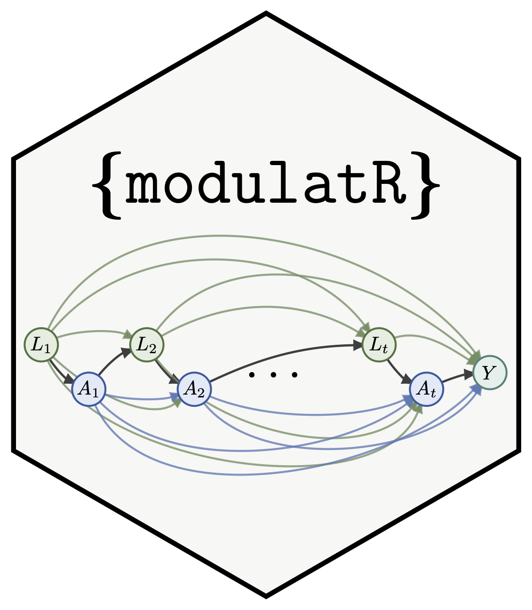

# `modulatR` 

Subgroup-specific Effects Under Longitudinal Modified Treatment Policies

**Work in Progress!**

`{modulatR}` aims to provide

- a clean interface for specifying (longitudinal) modified treatment
  policies
- with support for heterogeneous treatment effect estimation for
  (categorical/discrete) subgroups
- and supporting functions that visualize / report on the estimates

## installation

`{modulatR}` can be installed via GitHub using

``` r
devtools::install_github("ctesta01/modulatR")
```

## demo (not done yet!)

``` r
# workflow: 

# users should first specify the following: 
lmtp_data_struct <- ... 

config <- ... 

policy <- ... 

lmtp_task$new(
  lmtp_data_struct,
  config,
  estimation_strategy = 'tmle'
  )

lmtp_task$run()
```

# References and Similar Works
